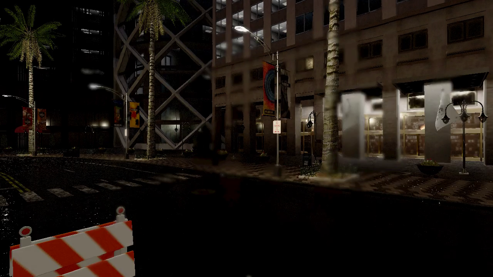

# CARLA Autonomy Lab

在 Ubuntu 22.04 + RTX 4080 Laptop（12 GB）上，**不装 Autoware**，
自己手写一套 CARLA 0.9.15 + ROS 2 Humble 的自动驾驶闭环仿真工程。

> 目标效果：Town10HD 雨夜场景里，车自己沿车道巡航、识别并绕开障碍物。

## 当前进度

| 里程碑 | 内容 | 状态 |
|---|---|---|
| M0 | CARLA 服务端 + Python 客户端连通 | 完成 |
| M1 | Town10HD 雨夜场景渲染 | 完成 |
| M2 | 自车 + Camera/LiDAR/IMU/GNSS | 完成 |
| M3 | 自研 CARLA↔ROS 2 桥，传感器进 ROS，控制回灌 | 完成 |
| M4 | RViz2 可视化（点云/相机/轨迹/TF） | 完成 |
| M5 | Pure Pursuit + PID 闭环巡线 | 完成（横向误差均值 0.27 m） |
| M6 | CasADi MPC | 进行中（直线好，偶发跑丢） |
| M7 | LiDAR 聚类 + YOLOv8 目标检测 | 完成 |
| M8 | **堵死了就重规划**（路径级避障） | **完成，3/3 连测通过** |

### M8 演示



> 雨夜 Town10HD，车道正中摆一个路障。车自己减速 → 判断堵死 →
> 往空的一侧借一个车道 → 绕过 → 回到原路线继续跑。
> 视频：[docs/media/m8_rain_night.mp4](docs/media/m8_rain_night.mp4)

三轮连测：重规划 6 / 16 / 26 次，最长停车 1.9–2.8 秒，**全部通过**。

**架构**（M8 的最终形态）：

```
纯跟踪(跟线) + 感知(LiDAR聚类) + 重规划(路径级避让)
                          ↑
        ST-Graph 时空规划器已移出闭环 —— 见 STATUS.md 里的说明
```

ST 规划器被移出闭环的原因值得记一笔：它在"本车道有障碍"时把速度封死，
而上层重规划已经下发了绕行路径，**两层在做相反的决策**，车就永远停在
原地。用二分法定位（基线 → 只加重规划 → 再加感知）才把它揪出来。

详细进度和踩过的坑见 [STATUS.md](STATUS.md)，方案见 [PLAN.md](PLAN.md)。

## 架构

```
CARLA 0.9.15 (Town10HD / 雨夜)
   │  Camera / LiDAR / IMU / GNSS
   ▼
carla_bridge  ── 自研桥（约 450 行）
   │  速度 PID 放在这一层（执行器层）
   ▼
/carla/ego/{camera,lidar,imu,gnss,odometry}
   │
   ├─► obstacle_detector   点云体素+并查集聚类 → 障碍物包围盒
   │
   ▼
pure_pursuit / mpc_controller   定位 → 前瞻 → 转角
   │  Twist(linear.x=目标速度, angular.z=前轮转角)
   ▼
carla_bridge → carla.VehicleControl → 虚拟车
```

**为什么不直接编译官方 `carla-ros-bridge`**：它要 colcon 编译十几个包、
依赖一堆消息包，在无 root 的 conda 环境里依赖链风险太高。
自研桥约 450 行，完全可控，也更符合"手写"的路线。

## 环境（无 sudo 也能装）

- **ROS 2 Humble**：走 RoboStack conda，直接复用 conda 的 **`test` 环境**
  （Python 3.10）。工程不再自建 `envs/ros2`，依赖全装在 `test` 里，
  不动 `base` / `yolo` / 其他环境。
  > `test` 原本是 Python 3.12，但 **carla 0.9.15 的 wheel 最高只到 cp310**，
  > 所以把它重建成 3.10 才装得上 carla 客户端。
- **CARLA 0.9.15**：官方 CDN 下载（GitHub releases 已迁走）
- **Python 3.10**：唯一同时满足 `carla==0.9.15`（wheel 最高 cp310）
  和 RoboStack humble（有 py310 构建）的版本

```bash
cd /home/tom/Desktop/ROS2
bash setup/create_ros_env.sh      # 建 ROS 2 conda 环境
bash setup/par_download.sh        # 多连接下载 CARLA（8.4 GB）
bash setup/extract_carla.sh       # 解压
source setup/activate.sh          # 进入工程环境
```

## 快速开始

```bash
cd /home/tom/Desktop/ROS2

bash setup/lab.sh start carla headless   # 起 CARLA（dev 模式会开窗口）
bash setup/lab.sh start bridge           # 起桥
bash setup/lab.sh start pursuit          # 纯跟踪控制器
bash setup/lab.sh start perception       # LiDAR 障碍物检测
bash setup/lab.sh start rviz             # 可视化

bash setup/lab.sh check m5               # 一键验收
bash setup/lab.sh stop
```

想在车道里摆路障测试避障：

```bash
# 注意：同步模式下第二个客户端查询会超时，要在起桥之前摆
bash setup/lab.sh start carla headless
python scripts/spawn_obstacles.py --at 30,90,160 --lateral 1.3
bash setup/lab.sh start bridge
```

## 目录

```
setup/       环境安装与 lab.sh 总控
scripts/     独立调试脚本 + 各里程碑验收脚本
ros2_ws/src/carla_autonomy/
  carla_autonomy/
    carla_bridge_node.py      自研 CARLA↔ROS 2 桥
    transforms.py             CARLA 左手系 <-> ROS 右手系
    route.py                  车道中心线闭环路线生成
    pure_pursuit_node.py      M5 纯跟踪 + 横向误差反馈 + 避障
    mpc_controller.py         M6 CasADi MPC
    obstacle_detector.py      M7 LiDAR 聚类障碍物检测
docs/        需求来源存档
```

## 参考 / 复用的开源项目

- **CARLA 自带 `PythonAPI/carla/agents`**（1995 行）：`GlobalRoutePlanner` /
  `LocalPlanner` / `BehaviorAgent` / `VehiclePIDController`。
  官方维护的路线规划 + 避障 + 红绿灯处理，是本项目**首选的复用对象**。
- [AtsushiSakai/PythonRobotics](https://github.com/AtsushiSakai/PythonRobotics)：
  各类规划控制算法的参考实现（Pure Pursuit / Stanley / MPC / RRT ...）。
- [carla-simulator/ros-bridge](https://github.com/carla-simulator/ros-bridge)：
  官方 ROS 桥，可对照它的消息设计。

## 已知坑（都写在 STATUS.md 里了）

1. CARLA `VehicleControl.steer` 正值是**右转**，ROS 是左转为正，必须取反。
2. `msg.data = bytes(...)` 会走 rosidl 的 `__debug__` 校验分支，
   3.7 MB 的图像要 200 ms；必须传 `array.array('B', ...)`，降到 1 ms。
3. CARLA 的 steer 增益实测是 **1.0 rad/unit**，不是 0.7。
4. LiDAR 装车顶会打到自己的引擎盖，`roi_x_min` 必须留够（≥3 m）。

## License

MIT
